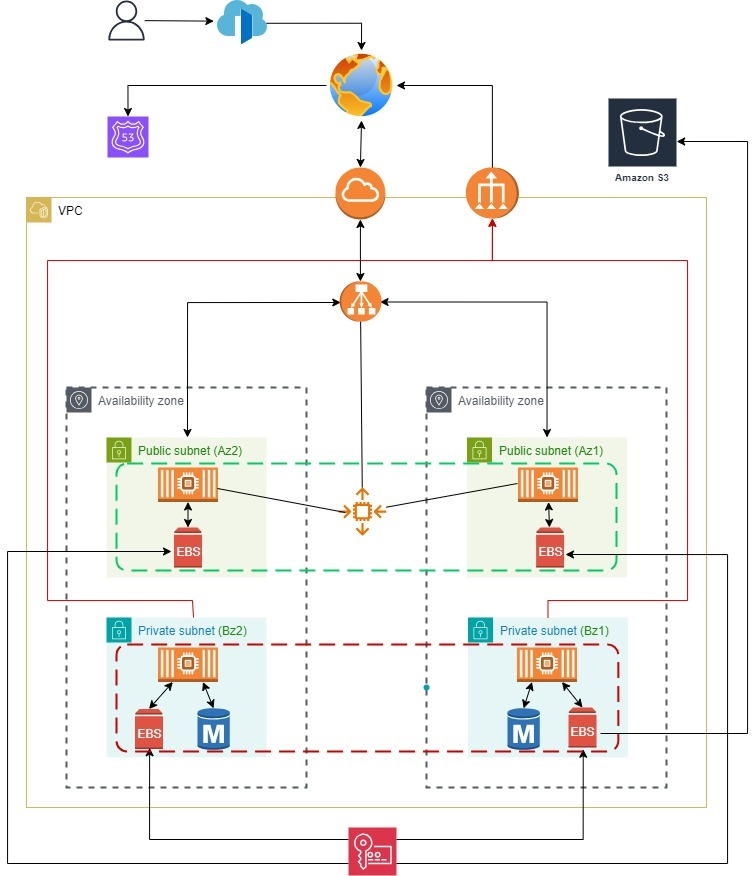

# E-commerce Website Setup Documentation 
### Images




## 1. Launch EC2 Instances

### Public Instances:
- Deploy the Python Flask application on EC2 instances in the public subnet.

### Private Instances:
- Deploy MariaDB (primary and standby) on EC2 instances in the private subnet.

## 2. Application Setup on EC2 (Public Instances)

### Install Python and Flask:
Run the following commands on your EC2 instance:

```bash
sudo yum update -y
sudo yum install python3 -y
pip3 install flask pymysql
```

## 3. Backend: Python (Flask) Code (`app.py`)

```python
from flask import Flask, request, jsonify, render_template
import pymysql
from datetime import datetime

app = Flask(__name__)

# Database connection settings
db_host = "10.0.134.170"  # Private IP of your MariaDB primary instance
db_user = "ecommerce_user"
db_password = "securepassword"
db_name = "ecommerce"

# Create connection to MariaDB
def create_connection():
    return pymysql.connect(host=db_host, user=db_user, password=db_password, database=db_name)

@app.route('/')
def home():
    return render_template("ecommerce_application.html")

@app.route('/add_order', methods=['POST'])
def add_order():
    customer_name = request.form['customer_name']
    product = request.form['product']
    quantity = request.form['quantity']
    order_date = request.form['order_date']
    order_date = datetime.strptime(order_date, '%Y-%m-%dT%H:%M')

    try:
        conn = create_connection()
        cursor = conn.cursor()
        query = "INSERT INTO orders (customer_name, product, quantity, order_date) VALUES (%s, %s, %s, %s)"
        cursor.execute(query, (customer_name, product, quantity, order_date))
        conn.commit()
        conn.close()
        return jsonify({"message": "Order added successfully!"}), 200
    except Exception as e:
        return jsonify({"error": str(e)}), 500

@app.route('/get_orders', methods=['GET'])
def get_orders():
    try:
        conn = create_connection()
        cursor = conn.cursor()
        cursor.execute("SELECT * FROM orders")
        result = cursor.fetchall()
        conn.close()
        orders = [{"id": row[0], "customer_name": row[1], "product": row[2], "quantity": row[3], "order_date": row[4].strftime('%Y-%m-%d %H:%M:%S')} for row in result]
        return jsonify(orders), 200
    except Exception as e:
        return jsonify({"error": str(e)}), 500

if __name__ == '__main__':
    app.run(host='0.0.0.0', port=5000)
```

## 4. Frontend: HTML (`ecommerce_application.html`)

```html
<!DOCTYPE html>
<html lang="en">
<head>
    <meta charset="UTF-8">
    <meta name="viewport" content="width=device-width, initial-scale=1.0">
    <title>E-commerce Platform</title>
    <style>
        body { font-family: Arial, sans-serif; background-color: #f4f4f4; text-align: center; }
        .form-container { margin: 20px auto; }
    </style>
</head>
<body>
    <h1>E-commerce Order Management</h1>
    <div class="form-container">
        <form id="orderForm">
            <input type="text" id="customer_name" placeholder="Customer Name">
            <input type="text" id="product" placeholder="Product">
            <input type="number" id="quantity" placeholder="Quantity">
            <input type="datetime-local" id="order_date">
            <button type="submit">Add Order</button>
        </form>
    </div>
    <button onclick="fetchOrders()">Fetch Orders</button>
    <ul id="orders-list"></ul>
    <script>
        function fetchOrders() { 
            fetch('http://52.210.4.0:5000/get_orders') 
                .then(response => response.json()) 
                .then(data => { 
                    let ordersList = document.getElementById("orders-list"); 
                    ordersList.innerHTML = ""; 
                    data.forEach(order => { 
                        let li = document.createElement("li"); 
                        li.textContent = `Order ID: ${order.id}, Customer: ${order.customer_name}, Product: ${order.product}, Quantity: ${order.quantity}, Date: ${order.order_date}`; 
                        ordersList.appendChild(li); 
                    }); 
                })
                .catch(error => console.log('Error fetching orders:', error));
        }
    </script>
</body>
</html>
```

## 5. Database Schema

#### Table: `orders`

```sql
CREATE TABLE orders (
    id INT AUTO_INCREMENT PRIMARY KEY,
    customer_name VARCHAR(255) NOT NULL,
    product VARCHAR(255) NOT NULL,
    quantity INT NOT NULL,
    order_date DATETIME NOT NULL
);
```

## 6. Backing Up MariaDB Database to S3

To backup the MariaDB database to S3, use the following commands:

### Step 1: Install AWS CLI

```bash
sudo yum install aws-cli -y
```

### Step 2: Configure AWS CLI with your credentials

```bash
aws configure
```

### Step 3: Create a database backup

Create a backup of your MariaDB database:

```bash
mysqldump -u root -p ecommerce > /home/ec2-user/ecommerce_backup.sql
```

### Step 4: Upload the backup to S3

```bash
aws s3 cp /home/ec2-user/ecommerce_backup.sql s3://your-bucket-name/ecommerce_backup.sql
```

## 7. Testing and Validation

1. **Access the Flask app** via the public EC2 instance IP.
2. **Add and view orders** through the frontend interface.
3. **Complete the remaining steps** to integrate Auto Scaling, S3 backups, and QuickSight visualization!

---


---

This markdown file outlines the necessary steps to set up your E-commerce website, including the backend application, frontend HTML interface, database schema, and how to back up your MariaDB database to S3.
